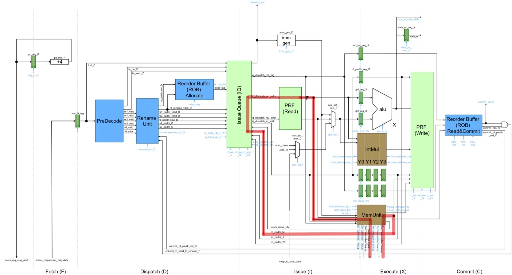
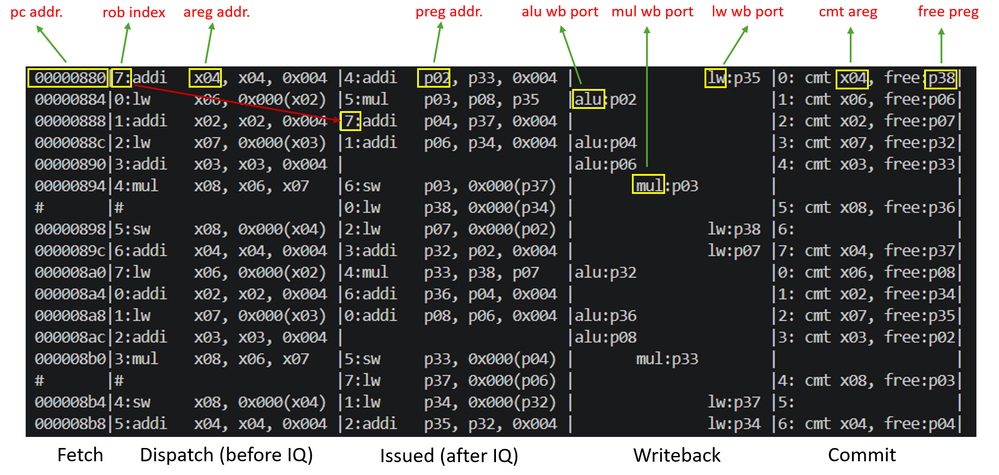
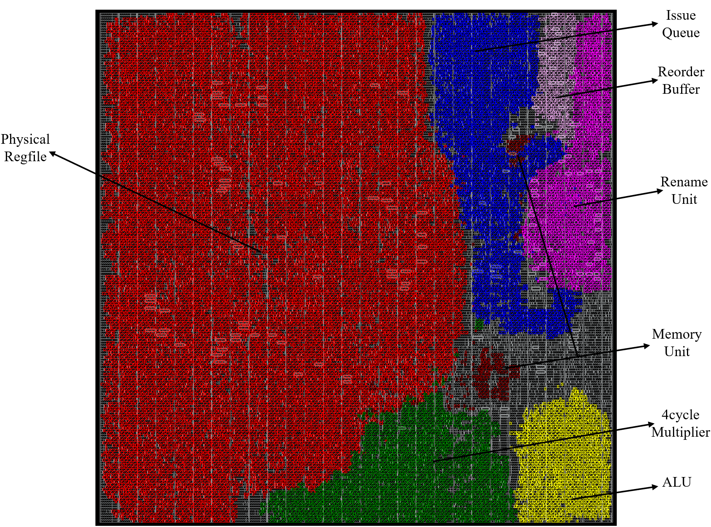

# RISC-V Out-of-Order Processor

This repository contains a single-issue out-of-order processor based on a RISC-V/TinyRV2 subset. The design focuses on out-of-order execution for arithmetic and memory/CSR-style programs while keeping the architectural state precise through in-order commit.

The core supports integer arithmetic instructions, CSR manager I/O instructions, and `lw`/`sw` memory instructions. Control-flow instructions such as branches, `jal`, and `jalr` are intentionally out of scope for this version. To make out-of-order behavior easy to observe, the integer multiplier is implemented as a fixed 4-cycle pipeline, so independent younger instructions can issue and write back while older multiply-dependent instructions wait.

## Repository Layout

The RTL and PyMTL3 wrappers live under `sim/`. The repository also includes annotated images used in this README and the full design report.

```text
.
|-- README.md
|-- OoO_proc_design_report.pdf
|-- images/
|   |-- OoO_Datapath.jpg
|   |-- OoO-post-pnr-breakdown.jpg
|   `-- linetrace_breakdown.jpg
`-- sim/
    |-- proj3/
    |   |-- ProcOoO.v / ProcOoO.py
    |   |-- ProcOoODpath.v
    |   |-- ProcOoOCtrl.v
    |   |-- ProcIssueQueue.v
    |   |-- ProcRenameUnit.v
    |   |-- ProcReorderBuffer.v
    |   |-- ProcPregfile.v
    |   |-- ProcMemunit.v
    |   |-- OoO_SingleCoreSys.v / OoO_SingleCoreSys.py
    |   `-- test/
    |-- cache/
    |-- sram/
    |-- vc/
    |-- pytest.ini
    `-- pymtl.ini
```

## Test Environment

The test infrastructure is based on Cornell's open-source PyMTL3 framework and `pytest`. Most tests are written in Python and instantiate either PyMTL3 models or Verilog placeholders through PyMTL3 wrappers.

This repository does not vendor the full Cornell course environment, so running the tests requires a compatible PyMTL3/pytest setup with the course support libraries available. The checked-in tests include module-level unit tests, processor-level directed tests, random differential tests, and system-level tests.

## Design Overview



At a high level, the processor can be understood through four visible stages:

```text
Dispatch -> Issued -> Writeback -> Commit
                |
          ALU / MUL / MEM
```

`Dispatch` performs predecode, register renaming, and ROB allocation. Architectural registers such as `x04` are mapped onto physical registers such as `p02`, and each instruction receives a ROB tag before entering the Issue Queue.

`Issued` represents the point where the Issue Queue selects an instruction whose operands are ready. After issue, the instruction enters one of three execution lanes: a 1-cycle ALU, a fixed 4-cycle multiplier, or the memory unit. These execution lanes sit between `Issued` and `Writeback` and are treated as black-box functional stages in the README-level view.

`Writeback` writes results into the Physical Register File and broadcasts wakeup information back to the Issue Queue. The design has separate writeback paths for ALU results, multiply results, and load results.

`Commit` is controlled by the Reorder Buffer. Instructions may issue and write back out of order, but they commit in program order. At commit time, the old physical destination register can be returned to the freelist.

Key structures in the design include:

- Register Rename Unit with RAT and freelist
- 64-entry Physical Register File
- 4-entry Issue Queue with scoreboard-based wakeup
- 8-entry Reorder Buffer for in-order commit
- 1-cycle ALU, 4-cycle pipelined multiplier, and single-in-flight memory unit

## Linetrace Walkthrough



The annotated linetrace shows a slice of the `dotprod-unrolled` benchmark. It is organized around the same four-stage view:

| Column | Meaning |
| --- | --- |
| Fetch | PC address of the fetched instruction |
| Dispatch | ROB index and architectural instruction before entering the Issue Queue |
| Issued | Instruction selected by the Issue Queue, shown with physical register operands |
| Writeback | Functional-unit result returning to the Physical Register File |
| Commit | In-order ROB retirement and freed physical register |

The trace makes the renaming and OoO behavior visible. In the Dispatch column, instructions still use architectural registers like `x04`. In the Issued column, those operands have been renamed to physical registers like `p02` and `p33`. The Writeback column shows which functional unit produced a value, such as `alu:p02`, `mul:p03`, or `lw:p38`.

Even when writeback events occur out of program order, the Commit column retires instructions through the ROB in order. The `free:pXX` field shows the previous physical register mapping being released back to the freelist.

## Physical Design Snapshot



The post-place-and-route breakdown highlights the main hardware blocks in the OoO core. The Physical Register File dominates the layout, which matches the expected cost of register renaming. The Issue Queue, Rename Unit, Reorder Buffer, Memory Unit, 4-cycle multiplier, and ALU are also visible as separate structures.

This view is useful for understanding the physical cost of the OoO mechanisms: the processor gains latency-hiding through renaming, dynamic scheduling, and in-order commit, but these structures add significant storage and control logic compared with a simple in-order core.

## Verification Summary

The final design was verified with several layers of tests:

- Reused arithmetic, immediate, CSR, and memory instruction tests
- Directed OoO tests for rename hazards, IQ wakeup, ROB commit, freelist recycling, and memory ordering
- Module-level tests for `ProcRenameUnit`, `ProcIssueQueue`, `ProcReorderBuffer`, `ProcPregfile`, and `ProcMemunit`
- Random differential tests comparing the OoO processor against the functional-level reference model
- System-level tests with instruction and data caches

The detailed methodology and quantitative results are described in the design report.

## Design Report

For the full architecture discussion, testing strategy, performance analysis, and physical design results, see [OoO_proc_design_report.pdf](OoO_proc_design_report.pdf).
