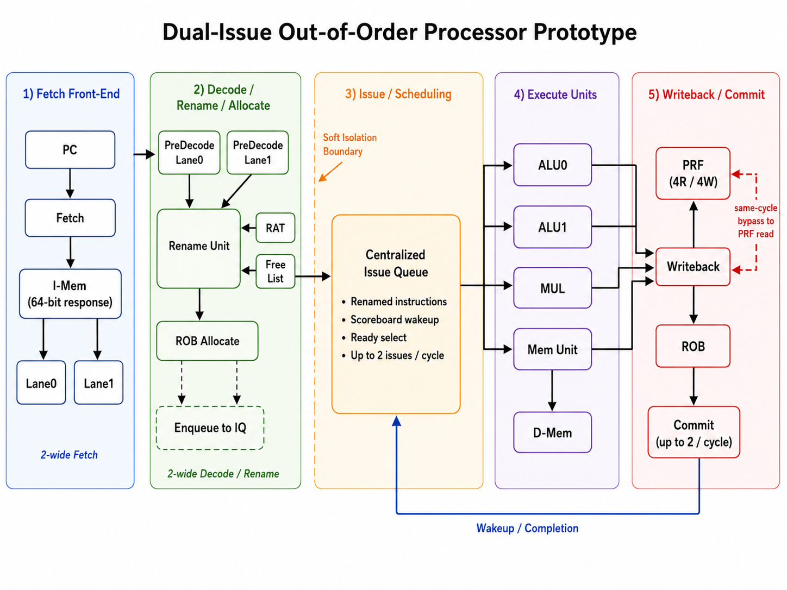

# RISC-V Dual-Issue Out-of-Order Processor

This repository contains a dual-issue out-of-order processor based on a
RISC-V/TinyRV2 subset. The current design fetches two 32-bit instructions at a
time, dispatches and renames up to two instructions per cycle, issues up to two
ready instructions per cycle, and keeps architectural state precise through
in-order ROB commit.

The core supports integer arithmetic instructions, CSR manager I/O instructions,
and `lw`/`sw` memory instructions. Control-flow instructions such as branches,
`jal`, and `jalr` are intentionally out of scope for this version. To make
out-of-order behavior easy to observe, the integer multiplier is implemented as
a fixed 4-cycle pipeline, so independent younger instructions can issue and
write back while older multiply-dependent instructions wait.

## Repository Layout

The RTL and PyMTL3 wrappers live under `sim/`. This branch focuses on the
dual-issue OoO processor itself; base-core comparison code and system-level
wrappers are not part of this version.

```text
.
|-- README.md
|-- images/
|   |-- dualissue-ooo-proc-diagram.png
|   `-- ...
`-- sim/
    |-- proj3/
    |   |-- ProcOoO.v / ProcOoO.py
    |   |-- ProcOoODpath.v
    |   |-- ProcOoOCtrl.v
    |   |-- ProcIssueQueue.v
    |   |-- ProcRenameUnit.v
    |   |-- ProcReorderBuffer.v
    |   |-- ProcPregfile.v
    |   |-- ProcMemunit.v
    |   |-- ProcOoO_linetrace_helper.v
    |   |-- proc-sim
    |   `-- test/
    |-- vc/
    |-- pytest.ini
    `-- pymtl.ini
```

## Test Environment

The test infrastructure is based on Cornell's open-source PyMTL3 framework and
`pytest`. Most tests are written in Python and instantiate either PyMTL3 models
or Verilog modules through PyMTL3 wrappers.

This repository does not vendor the full Cornell course environment, so running
the tests requires a compatible PyMTL3/pytest setup with the course support
libraries available. The checked-in tests include module-level unit tests and
processor-level directed tests for arithmetic, immediate, CSR, memory, rename,
issue, writeback, and ROB behavior.

## Design Overview



At a high level, the processor can be understood through five visible stages:

```text
Fetch2 -> Dispatch2 -> Issue Queue -> Issue0/Issue1 -> Writeback -> Commit2
                              |
                    ALU0 / ALU1 / MUL / MEM
```

`Fetch2` requests two sequential instructions together. The front end only
advances when both instruction slots are available, which keeps the current
dual-fetch contract simple.

`Dispatch2` performs predecode, register renaming, and ROB allocation for up to
two instructions in program order. Architectural registers such as `x04` are
mapped onto physical registers such as `p02`, and each instruction receives a
ROB tag before entering the Issue Queue.

The `Issue Queue` stores the original instruction bits, renamed physical source
and destination registers, and ROB tags. It intentionally does not store full
decoded control signals, which keeps dispatch routing flexible as execution
lanes are added.

`Issue0/Issue1` represents the point where the Issue Queue selects up to two
ready instructions. Ready instructions are routed onto one of four execution
channels: `ALU0`, `ALU1`, `MUL`, or `MEM`. CSR-style operations share the ALU0
path.

`Writeback` writes results into the Physical Register File and broadcasts wakeup
information back to the Issue Queue. The design has separate writeback feedback
paths for ALU0, ALU1, multiply, and memory results.

`Commit2` is controlled by the Reorder Buffer. Instructions may issue and write
back out of order, but they commit in program order. The ROB can commit zero,
one, or two consecutive ready instructions per cycle, and the old physical
destination registers are returned to the freelist at commit time.

Key structures in the design include:

- Two-wide instruction fetch and dispatch front end
- Register Rename Unit with RAT and freelist
- 64-entry Physical Register File
- 8-entry Issue Queue with scoreboard-based wakeup
- 16-entry Reorder Buffer with two-wide allocate and two-wide commit
- Two 1-cycle ALUs, a 4-cycle pipelined multiplier, and a memory unit
